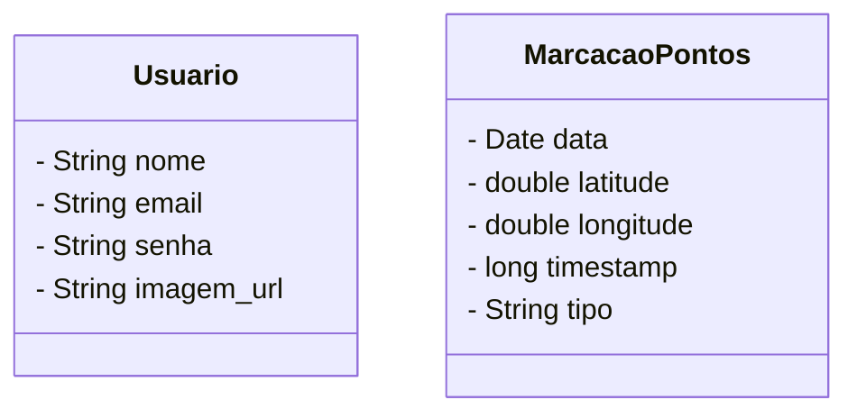
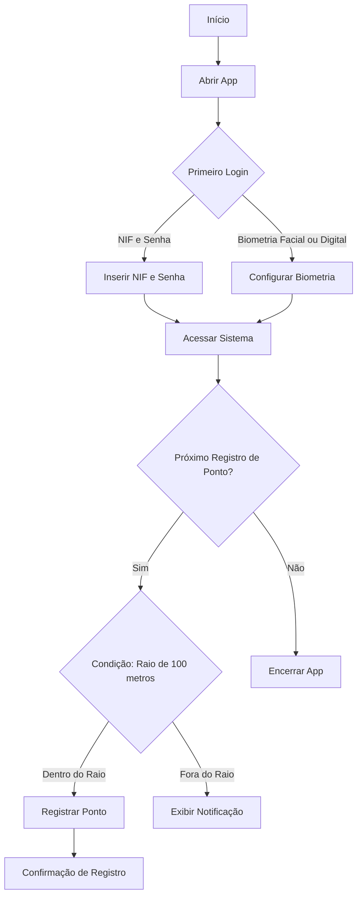

</a>
### Contexto Inicial
**App de Registro de Ponto com Geolocalização e Biometria:**
Um aplicativo que permite ao funcionário registrar seu ponto de trabalho quando estiver a até 100 metros do local de trabalho. A autenticação pode ser feita via NIF e senha ou utilizando reconhecimento digital e/ou facial via biometria.

 
 
 

   

   
  
  
  

 
   

</a>

## Apresentação do Projeto: Desenvolvimento de Aplicativo sobre Registro de Ponto

### Visão Geral do Projeto
**Objetivo:**
Desenvolver um aplicativo para registro de ponto do funcionário, efetuando o seu login pelo meio padrão com o seu email e a sua senha ou utilizando a sua digital e/ou reconhecimento facial via biometria. Além disso, para ele efetuar o seu registro ele precisará estar até 100 metros do local do seu trabalho, caso contrário o registro não será possível e ele receberá uma notificação no aplicativo.

**Por Que Este Projeto?**
A nossa empresa chamada FastPoint, dedicada a inovar no campo da gestão de serviços, está em processo de criação de um aplicativo de registro de ponto do funcionário com geolocalização e biometria. Este projeto visa proporcionar uma experiência eficiente e ágil para o funcionário, facilitando o processo de registro e autenticação por meio da sua biometria. Com o objetivo de transformar a forma como a nossa empresa registra o ponto do funcionário, estamos desenvolvendo uma solução tecnológica avançada que ofereça uma interface amigável e funcionalidades robustas.
     
</a>

O registro de ponto será desenvolvido utilizando o framework Flutter, com Firebase para nossa plataforma de serviços de backend. A solução visa proporcionar uma experiência para o funcionário eficiente e intuitiva, com recursos para autenticação via biometria digital e/ou facial, além da sua geolocalização em tempo real para o registro do ponto.
     

</a>

**Firebase:**
- Authentication
- Cloud Firestore

**Framework Flutter (dependências):**
- **cloud_firestore** (relacionada ao firebase)
- **firebase_auth** (relacionado ao firebase)
- **firebase_core** (relacionado ao firebase)
- **firebase_messaging** (relacionado ao firebase)
- **local_auth** (autenticação via biometria)
- **flutter_secure_storage** (autenticação via biometria)
- **geolocator** (localização)
- **flutter_map** (mapa visual)

**Outros:**
- Android Studio para desenvolvimento
- Github para versionamento
- Figma para montagem dos protótipos

     

     

     

### - Requisitos:

- Conexão com a Internet
- Dispositivo com funcionalidade biométrica e facial

### 1. Acesso ao Aplicativo

1.1 **Entrada:**
   - Entre no aplicativo pelo seu dispositivo.

1.2. **Primeiro Login:**
   - Ao acessar pela primeira vez, insira seu **NIF e senha** ou configure sua biometria facial/digital para um login mais rápido e seguro.
  
### 2. Autenticação

#### O FastPoint oferece duas opções de autenticação:

2.1 **NIF e senha:**
   - Insira suas credenciais para acessar o sistema.

2.2 **Reconhecimento facial ou digital:**
   - Utilize biometria para maior agilidade e segurança.
  
### 3. Registro de Ponto

#### Condições para registro:
   - O registro é permitido apenas se você estiver dentro de um raio de 100 metros do local de trabalho.
   - A geolocalização é verificada automaticamente no momento do registro.

#### Passo a passo:
   - Abra o aplicativo e escolha a forma de autenticação (biometria ou NIF e senha).
   - Aproxime-se do local de trabalho até que a localização seja validada.
   - Clique no botão **"Registrar Ponto"**.
   - Verifique a confirmação do registro na tela.

  
### 4. Notificações e Falhas no Registro

#### Caso esteja fora do limite de 100 metros, o aplicativo exibirá uma notificação:
**"Não foi possível registrar o ponto. Você está fora do limite permitido."**

     

  <table style="width: 100%">
    <tbody>
      <tr align=center>
        <th><strong> Eduardo Sinico   Edu1Sinico </strong></th>
        <th><strong> João Victor de Lima   JoaovlLima </strong></th>
        <th><strong> Rafael Souza de Moura   rafaelmoura23</strong></th>
         <th><strong> Vinícius Granço Feitoza   epicestudar </strong></th>
      </tr>
      <tr align=center>
        <td>
          
        </td>
        <td>
          
        </td>
         <td>
          
        </td>
         <td>
          
        </td>
      </tr>
    </tbody>

  </table>

